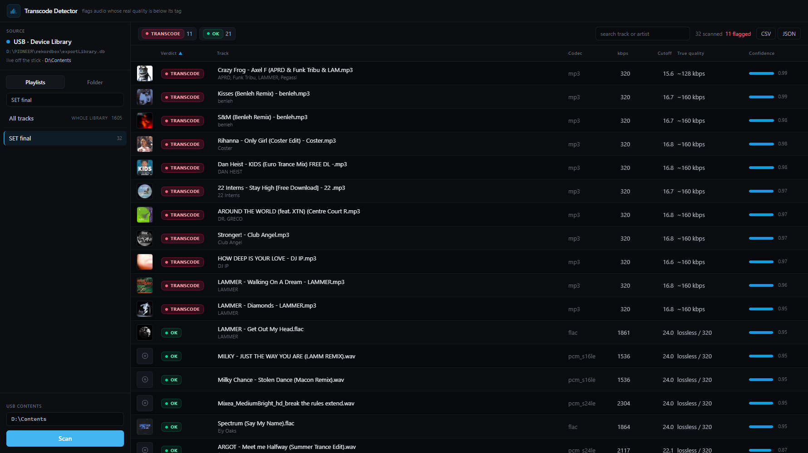

# Transcode Detector

A local app that scans a music library and flags audio files whose **real**
quality is lower than their tag claims — e.g. a 128 kbps source re-encoded and
re-tagged as 320 kbps. It can read a **Rekordbox playlist** directly (including
the copies exported to a DJ USB stick) or scan any folder.

The detection signal is the **high-frequency cutoff**: lossy encoders low-pass
the audio, and a transcode can't recreate frequencies the original already
discarded. A genuine 320 reaches ~20 kHz; a 320 re-encoded from a 128/160 source
brick-walls at ~15–17 kHz. The spectrogram is the proof — the brick wall is
visible to the naked eye.



## How it works

For each track (`backend/analysis.py`, fully unit-tested):

1. **Probe** with ffprobe (codec, declared bitrate, sample rate, duration).
2. **Decode** to mono float32 at the file's *native* sample rate via ffmpeg
   (no upsampling — that would invent a Nyquist ceiling and hide the cutoff).
3. **Segment**: split into 5 s windows, keep the loudest 25% (quiet intros have
   no HF content and cause false positives).
4. **Spectrum**: averaged Welch PSD (Hann, nperseg 8192), in dB.
5. **Cutoff**: reference = median 1–10 kHz; floor = reference − 50 dB; walk down
   from Nyquist — the cutoff is the first frequency back above the floor.
6. **Shelf test**: a genuine track rolls off gradually; a transcode shows a flat
   spectrum then a vertical cliff (>30 dB over <500 Hz). This is the strong tell.
7. **Verdict + confidence**:
   - `TRANSCODE` — cutoff well below the floor expected for the declared bitrate
     **and** a sharp brick-wall shelf (high confidence).
   - `SUSPECT` — low cutoff but gradual roll-off (could be genuine low-HF /
     acoustic material — flagged for review, low confidence).
   - `LOSSY SOURCE` — a lossless container (FLAC/ALAC/WAV) whose spectrum cuts
     off below 19 kHz (a lossy original re-wrapped as lossless).
   - `OK` — otherwise.

   A hard `TRANSCODE` is never emitted without the shelf test passing — false
   positives on sparse/acoustic material are the main failure mode.

## Rekordbox integration

When a DJ USB is connected, `backend/devicelib.py` reads the USB's own **Device
Library Plus** database (`PIONEER/rekordbox/exportLibrary.db`, decrypted with the
fixed device-library key) — the authoritative, *current* playlist set for the
stick, with exact on-USB file paths. This is what plays at the gig, and it
avoids the common trap where the desktop `master.db` is out of sync (tracks added
to a playlist on the stick or another machine that never synced back).

With no USB present it falls back to `backend/rekordbox_source.py`, which reads
the desktop `master.db` (via pyrekordbox, auto-key) and maps each playlist track
to its USB copy by filename + exact byte size. USB `Contents` folders are
auto-detected, and the sidebar shows which source (USB vs desktop) is in use.

## Setup

**Prerequisites:** Python 3.11+, Node 18+, and **ffmpeg/ffprobe on PATH** (the
backend checks at startup and fails with a clear message otherwise).
Windows: `winget install Gyan.FFmpeg` · macOS: `brew install ffmpeg` ·
Linux: `apt install ffmpeg`.

One command:

```powershell
.\setup.ps1        # Windows
./setup.sh         # macOS / Linux
```

<details><summary>…or set up manually</summary>

```powershell
python -m venv .venv
.\.venv\Scripts\python.exe -m pip install -r requirements.txt
npm --prefix frontend install
```
</details>

The Rekordbox feature decrypts the desktop `master.db`; the required
`sqlcipher3-wheels` is installed automatically with `pyrekordbox`. The plain
**folder-scan** mode works without Rekordbox at all.

## Run

```powershell
.\run.ps1        # Windows — starts backend (:8000) + frontend (:5173), opens the browser
./run.sh         # macOS / Linux
```

Or manually:

```powershell
.\.venv\Scripts\python.exe -m uvicorn backend.main:app --port 8000
npm --prefix frontend run dev
```

### Command line (no browser)

```powershell
.\.venv\Scripts\python.exe cli.py --playlist "SET FINAL"
.\.venv\Scripts\python.exe cli.py --folder "D:\Contents"
```

### Tests

```powershell
.\.venv\Scripts\python.exe -m pytest
```

The three synthetic gating cases (full-band noise → OK, 16 kHz-low-passed noise →
TRANSCODE, gradually band-limited → SUSPECT) gate the detection logic.

## API

- `POST /api/scan` — `{path}` (folder) or `{playlist, contentsRoot?}` → `{scanId, total}`
- `GET  /api/scan/{id}/events` — SSE stream of per-file results
- `GET  /api/scan/{id}` — full results (polling fallback)
- `GET  /api/scan/{id}/export?format=csv|json&verdicts=TRANSCODE,...`
- `GET  /api/spectrogram?file=<path>&expected=&measured=` — PNG, rendered on demand
- `GET  /api/rekordbox/playlists`, `/api/rekordbox/usb-roots`, `/api/health`

## Non-goals

No accounts, no cloud, no audio playback, no library editing or re-tagging.
Read-only analysis of a local folder / USB. Results are ephemeral per scan
(held in memory), exportable to CSV/JSON.
